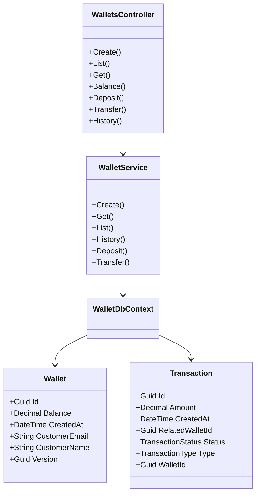

# Diagrama de clases

```mermaid
classDiagram
    class Transaction {
        +Guid Id
        +Decimal Amount
        +DateTime CreatedAt
        +Guid RelatedWalletId
        +TransactionStatus Status
        +TransactionType Type
        +Guid WalletId
    }
    class Wallet {
        +Guid Id
        +Decimal Balance
        +DateTime CreatedAt
        +String CustomerEmail
        +String CustomerName
        +Guid Version
    }
    class WalletService {
        +Create()
        +Get()
        +List()
        +History()
        +Deposit()
        +Transfer()
    }
    class WalletsController {
        +Create()
        +List()
        +Get()
        +Balance()
        +Deposit()
        +Transfer()
        +History()
    }
    class WalletDbContext {
    }
    WalletsController --> WalletService
    WalletService --> WalletDbContext
    WalletDbContext --> Wallet
    WalletDbContext --> Transaction
```
