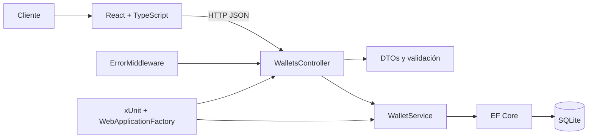

# Diagrama de componentes

Generado automáticamente. Arquitectura declarada por el proyecto.

```mermaid
flowchart LR
    User[Cliente] --> React[React + TypeScript]
    React -->|HTTP JSON| Controller[WalletsController]
    Controller --> Validation[DTOs y validación]
    Controller --> Service[WalletService]
    Service --> EF[EF Core]
    EF --> SQLite[(SQLite)]
    Middleware[ErrorMiddleware] --> Controller
    Tests[xUnit + WebApplicationFactory] --> Controller
    Tests --> Service
```
