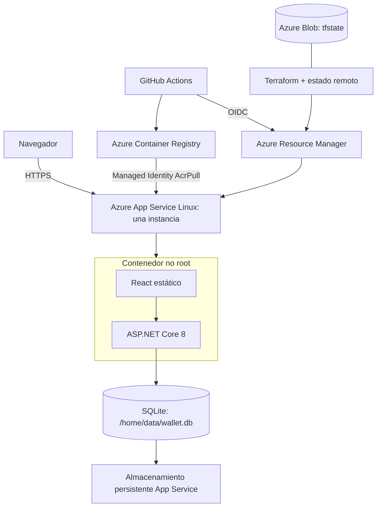

# Diagrama de despliegue

Generado automáticamente. Arquitectura declarada por el proyecto.

```mermaid
flowchart TB
    Browser[Navegador] -->|HTTPS| App[Azure App Service Linux: una instancia]
    subgraph Container[Contenedor no root]
        Frontend[React estático] --> API[ASP.NET Core 8]
    end
    App --> Container
    API --> DB[(SQLite: /home/data/wallet.db)]
    DB --> Volume[Almacenamiento persistente App Service]
    Actions[GitHub Actions] -->|OIDC| Azure[Azure Resource Manager]
    Terraform[Terraform + estado remoto] --> Azure
    Azure --> App
    Actions --> Registry[Azure Container Registry]
    Registry -->|Managed Identity AcrPull| App
    State[(Azure Blob: tfstate)] --- Terraform
```
