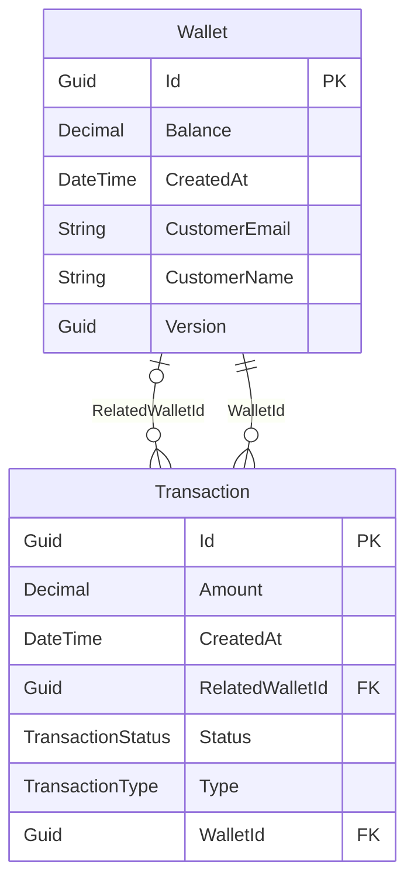

# Diagrama entidad-relación

```mermaid
erDiagram
    Transaction {
        Guid Id PK
        Decimal Amount
        DateTime CreatedAt
        Guid RelatedWalletId FK
        TransactionStatus Status
        TransactionType Type
        Guid WalletId FK
    }
    Wallet |o--o{ Transaction : "RelatedWalletId"
    Wallet ||--o{ Transaction : "WalletId"
    Wallet {
        Guid Id PK
        Decimal Balance
        DateTime CreatedAt
        String CustomerEmail
        String CustomerName
        Guid Version
    }
```
